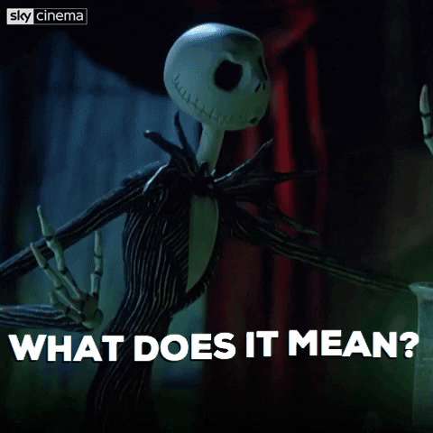

# btcWallet

Bitoin Wallet in Rust via tutorial Matthew Ramsden https://matthewramsden.substack.com/p/developing-a-bitcoin-wallet-with

TODO (from tutorial):
    
    5. Create Address
    
    6. Receive Bitcoin
    
    7. Send Bitcoin
    
    ♾️. Read the code

